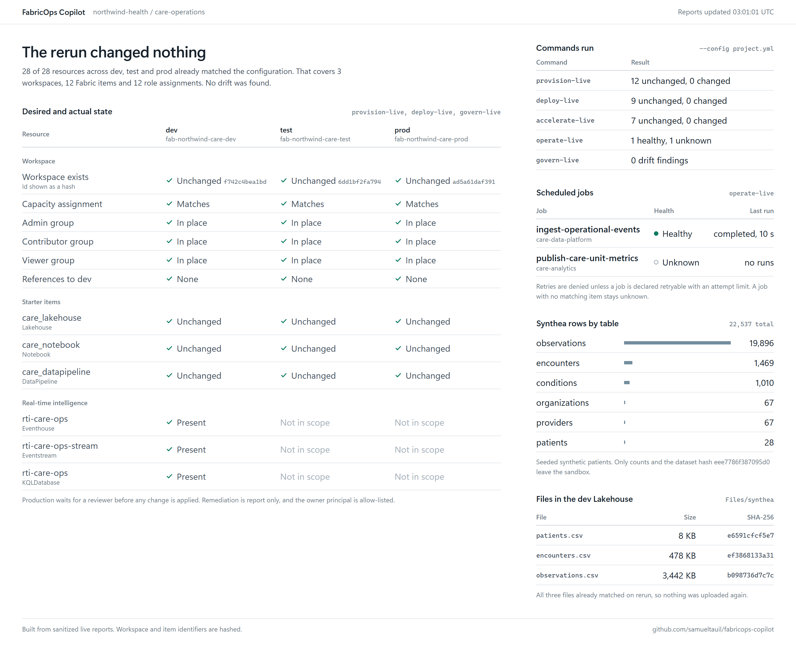
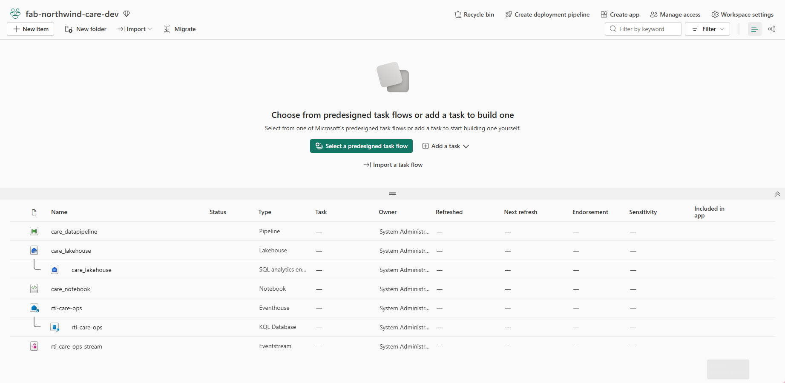
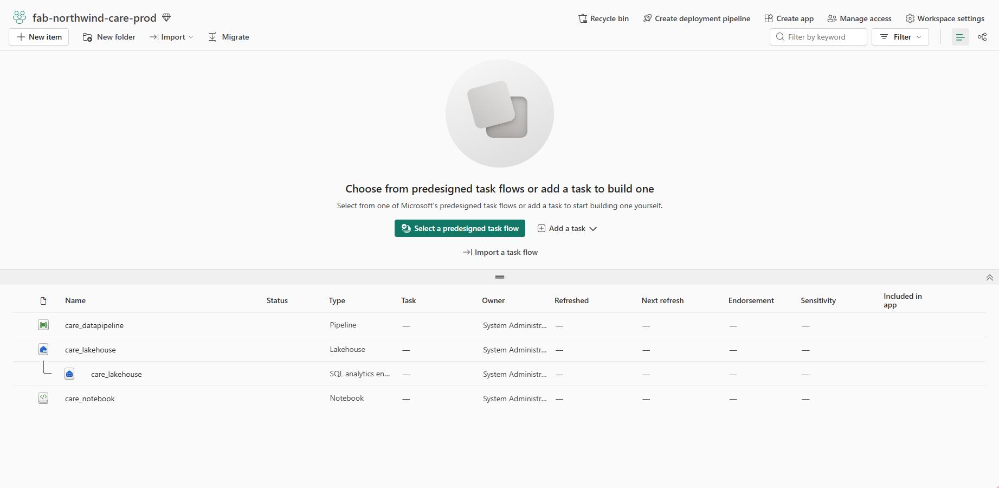
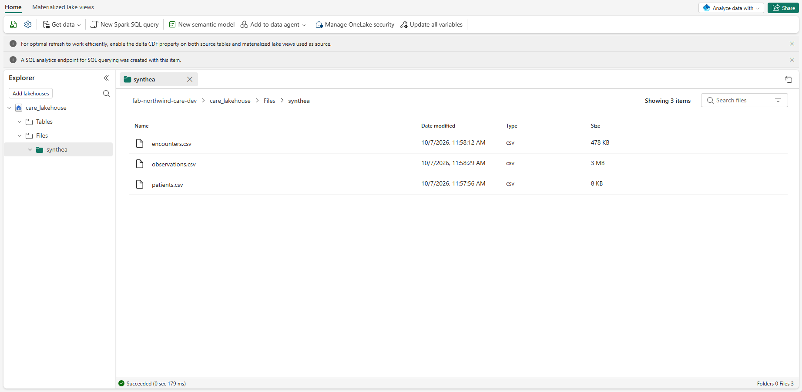
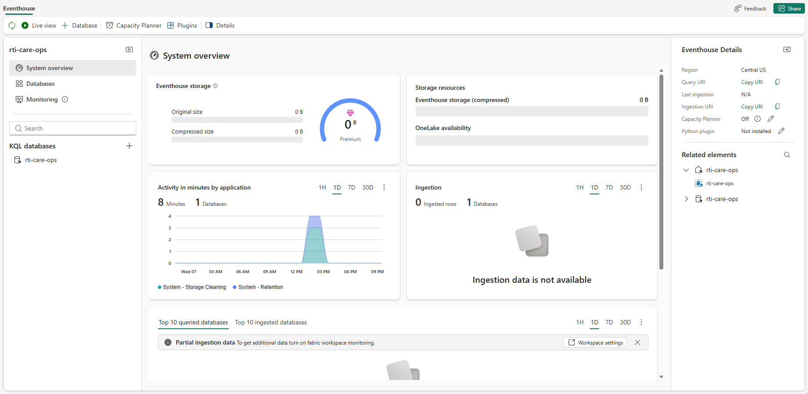

# FabricOps Copilot

Configuration-driven automation for the repetitive administration of Microsoft Fabric, so teams can spend their time on RTI, Fabric IQ, ontologies and agents instead of setup checklists. GitHub Copilot is used as a **developer accelerator**; deterministic code and approval gates do the execution.

> Demo/POC. All data is synthetic (generated with [Synthea](https://github.com/synthetichealth/synthea)). No PHI, no customer data.

```
FabricOps Copilot
├── Provision   Fabric landing zones (workspaces, capacity, roles, starter items)
├── Deploy      Governed dev -> test -> prod promotion
├── Operate     Health monitoring + safe, policy-gated recovery
├── Govern      Access and configuration drift
└── Accelerate  RTI, Fabric IQ, ontology, agents
```

## Principles

- **Configuration, not customer code**: one YAML describes the project; the engine is stable.
- **Safe reruns**: deterministic logical keys; a second run is a no-op.
- **Preview before change**: `plan` first, stale-plan detection, no deletes, production behind approval.
- **Least privilege, customer-owned credentials**: OIDC / `az login`, no secrets in the repo.
- **Audit without sensitive data**: allowlisted evidence, hashed IDs, row counts only.

## How GitHub Copilot is used

Copilot is a **builder and assistant, not an operator**. It never holds credentials and
never calls Fabric on its own. The deterministic CLI and the approval-gated GitHub
workflows do all the changing.

| Phase | Copilot's role | Guardrail |
|---|---|---|
| Design | Turned the admin pain points into the five pillars, the config schema and the safety rules. | Reviewed by a human before any code ran. |
| Build | Generated and iterated the Python engine, live adapters, tests, workflows and these docs, in the terminal with Copilot CLI. | Tests (`pytest`) and `ruff` must pass; idempotency and sanitization are tested. |
| Fabric knowledge | Uses the [Fabric MCP server](docs/fabric-mcp.md) for REST API specs, item-definition schemas and best practices. | MCP informs code; it is not a production execution path. |
| Repo guidance | `.github/copilot-instructions.md` and `.github/prompts/` teach Copilot the rules: config over code, plan before apply, no sensitive logging, unknown means blocked. | New item support must update the capability matrix and add rerun tests. |
| Maintenance | Prompt files for "add support for a Fabric item type" and "diagnose a sanitized run". | Only sanitized evidence is shared with Copilot, never PHI, tokens or definitions. |
| Review | Copilot code review and PR checks on changes to the engine. | Production workflows need a human reviewer on the `prod` environment. |

Why this split: administration changes must be repeatable and auditable, so they run as
reviewed code. Copilot's value is making that code, and its extensions to new Fabric
workloads, much faster to produce. See the [demo runbook](docs/demo-runbook.md) for a
live Copilot moment.

## Live demo (real Fabric tenant)



This dashboard is generated by `scripts/build_dashboard.py` from the sanitized JSON reports that `provision-live`, `deploy-live`, `operate-live`, `govern-live` and `accelerate-live` wrote after running against a real Fabric capacity. Workspace IDs appear only as hashes. Regenerate it with:

```powershell
python scripts/build_dashboard.py artifacts/real          # static PNG
python scripts/build_dashboard.py artifacts/real --serve  # live, auto-updating at http://127.0.0.1:8765
```

Run the `--serve` form in a second window while you run the demo commands and the dashboard updates as each report is written. See the [demo runbook](docs/demo-runbook.md#optional-run-the-dashboard-live-during-the-demo).

### What it created in the Fabric portal

Screenshots from the live tenant (browser chrome, URLs, account and capacity details are cropped out).

**Dev workspace**: Lakehouse, Notebook, Pipeline plus the RTI items (Eventhouse, KQL database, Eventstream)



**Prod workspace**: same starter items, promoted by the Deploy pillar



**Synthea CSVs in the Lakehouse** (`Files/synthea`)



**Eventhouse `rti-care-ops`** created by Accelerate



## Quick start (your own Fabric tenant)

```powershell
python -m venv .venv; .\.venv\Scripts\Activate.ps1
pip install -e ".[live]"
az login
```

1. Copy `config/examples/synthetic-healthcare/live.env.example` to `live.local.env` (git-ignored) and fill in your tenant, app, capacity and group IDs.
2. Run `fabricops preflight`, then `provision-live`, `deploy-live`, `accelerate-live`, `operate-live` and `govern-live`. All preview or read only by default; mutation needs `--apply` (or `--run` for jobs) **and** `FABRICOPS_ALLOW_LIVE_MUTATION=1`.
3. GitHub Actions: workflows run on `workflow_dispatch` with OIDC. Set `AZURE_CLIENT_ID`, `AZURE_TENANT_ID` and the `FABRIC_*` repo variables; prod needs environment approval. The tenant must allow service principals to call Fabric APIs.

Synthea needs Java 11+. Never commit tenant, subscription, group or capacity IDs; `.gitignore` excludes `*.local.env`, `.env*`, `artifacts/` and `.fabricops/`.
## Fabric MCP

`.vscode/mcp.json` and `.mcp.json` register the [Fabric MCP server](docs/fabric-mcp.md), used by Copilot for API docs and item-definition contracts.

## Docs

[Demo runbook](docs/demo-runbook.md) (start here) · [Architecture](docs/architecture.md) · [Security model](docs/security-model.md) · [Capability matrix](docs/capability-matrix.md) · [Fabric MCP](docs/fabric-mcp.md) · [Use-case insights](docs/use-case-insights.md)

## Status

All five pillars run live against a Fabric sandbox. Fabric IQ, ontology and agent templates remain capability probes (preview APIs). The GitHub Actions workflows are untested end to end.
