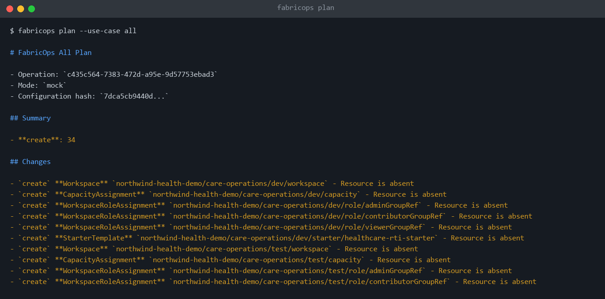
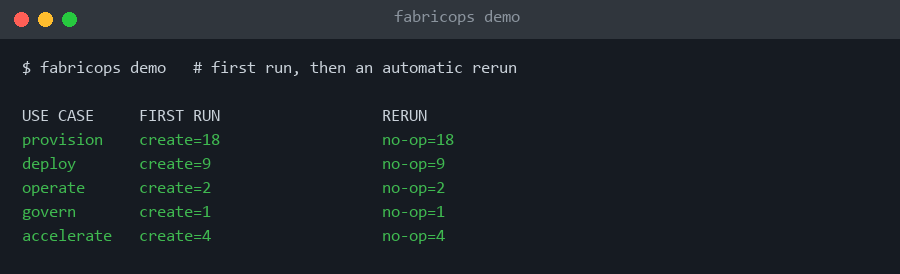
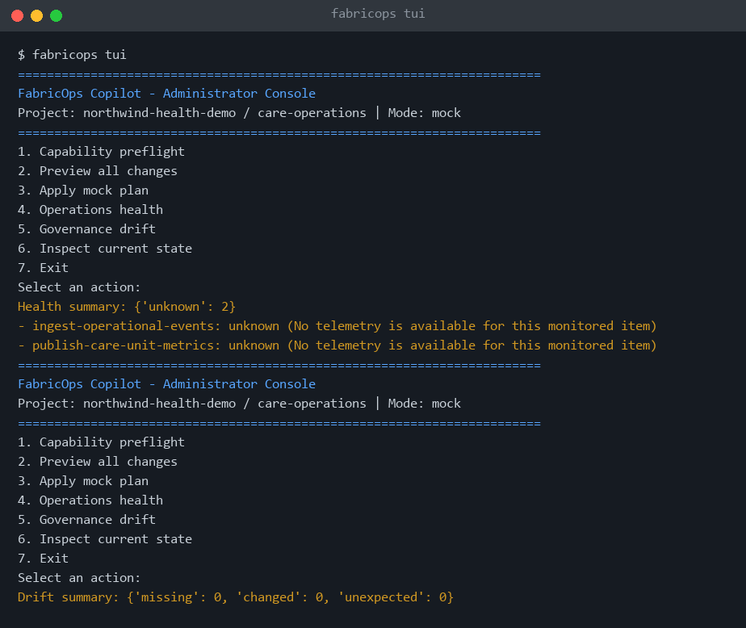
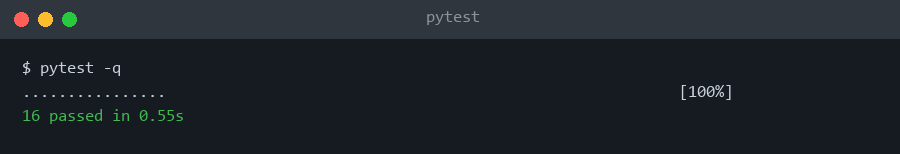

# FabricOps Copilot

Configuration-driven automation for the repetitive administration of Microsoft Fabric, so teams can spend their time on RTI, Fabric IQ, ontologies and agents instead of setup checklists. GitHub Copilot is used as a **developer accelerator**; deterministic code and approval gates do the execution.

> Demo/POC. All data is synthetic (generated with [Synthea](https://github.com/synthetichealth/synthea)). No PHI, no customer data.

```
FabricOps Copilot
├── Provision   Fabric landing zones (workspaces, capacity, roles, starter items)
├── Deploy      Governed dev -> test -> prod promotion
├── Operate     Health monitoring + safe, policy-gated recovery
├── Govern      Access and configuration drift
└── Accelerate  RTI, Fabric IQ, ontology, agents
```

## Principles

- **Configuration, not customer code**: one YAML describes the project; the engine is stable.
- **Safe reruns**: deterministic logical keys; a second run is a no-op.
- **Preview before change**: `plan` first, stale-plan detection, no deletes, production behind approval.
- **Least privilege, customer-owned credentials**: OIDC / `az login`, no secrets in the repo.
- **Audit without sensitive data**: allowlisted evidence, hashed IDs, row counts only.

## Screenshots (mock mode)

Preview before change:



Idempotent reruns across all five pillars:



Optional administrator TUI (health and drift):



Synthea synthetic dataset (aggregate counts and hash only):


Tests:



## Quick start (mock mode, no tenant needed)

```powershell
python -m venv .venv; .\.venv\Scripts\Activate.ps1
pip install -e ".[dev]"
python -m fabricops.cli capabilities
python -m fabricops.cli plan --config config/examples/synthetic-healthcare/project.yml --use-case all
python -m fabricops.cli demo --config config/examples/synthetic-healthcare/project.yml
python -m fabricops.cli tui --config config/examples/synthetic-healthcare/project.yml
```

`demo` runs Synthea first (needs Java 11+; use `--skip-synthea` to opt out), then each use case twice to prove idempotency.

## Live mode (your own Fabric tenant)

1. `pip install -e ".[live]"` and sign in with `az login` (or use GitHub OIDC).
2. Copy `config/examples/synthetic-healthcare/live.env.example` to `live.local.env` (git-ignored) and fill in your tenant, app, capacity and group IDs.
3. Run `preflight`, then `provision-live` and `deploy-live`. Both preview by default; mutation needs `--apply` **and** `FABRICOPS_ALLOW_LIVE_MUTATION=1`.

Never commit tenant, subscription, group or capacity IDs. `.gitignore` excludes `*.local.env`, `.env*`, `artifacts/` and `.fabricops/`.

## Fabric MCP

`.vscode/mcp.json` and `.mcp.json` register the [Fabric MCP server](docs/fabric-mcp.md), used by Copilot for API docs and item-definition contracts.

## Docs

[Architecture](docs/architecture.md) · [Security model](docs/security-model.md) · [Capability matrix](docs/capability-matrix.md) · [Demo runbook](docs/demo-runbook.md) · [Use-case insights](docs/use-case-insights.md)

## Status

Live and verified: Provision and Deploy. Mock-only so far: Operate, Govern, Accelerate.
