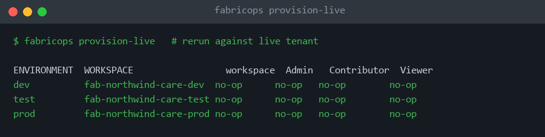
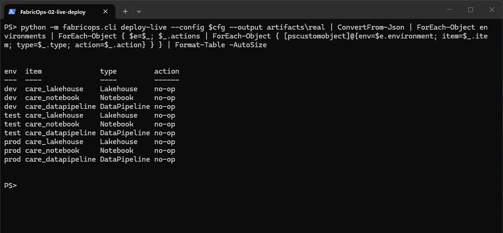
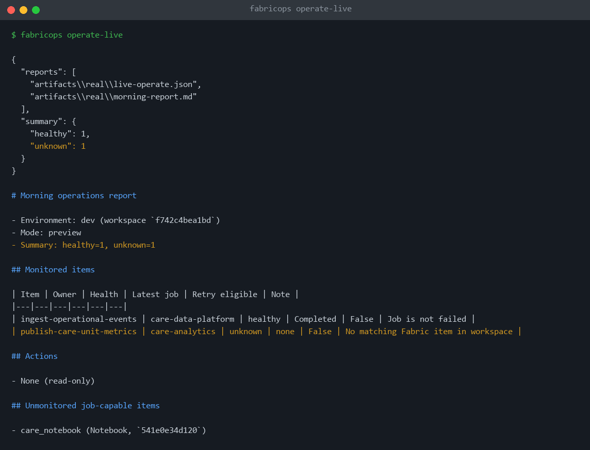
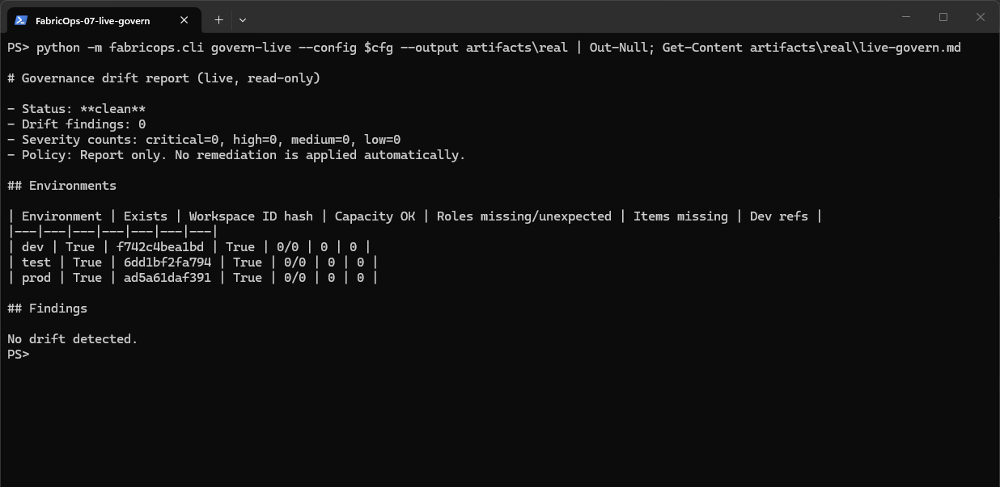
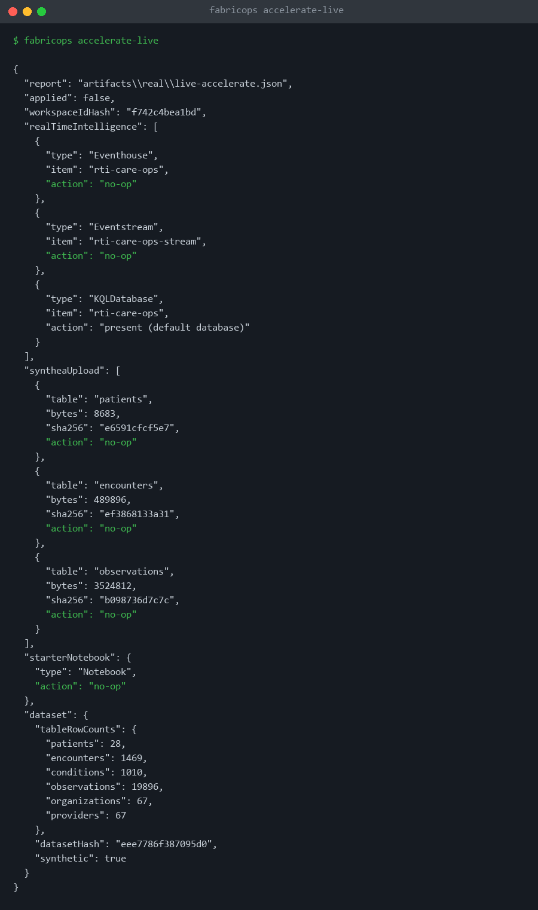
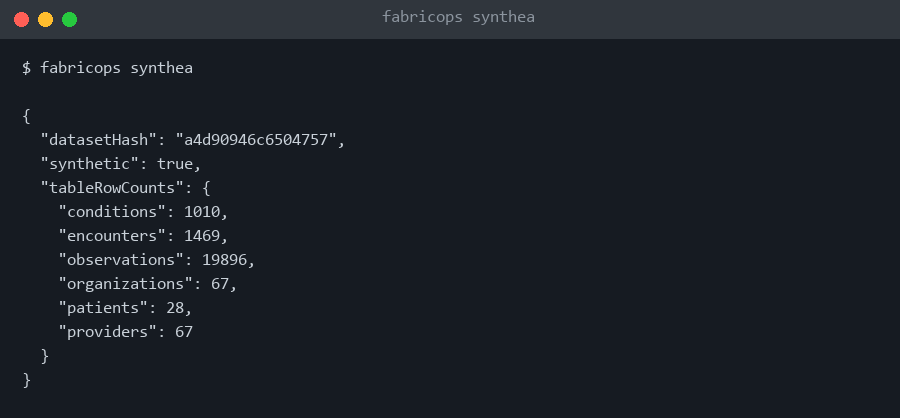

# FabricOps Copilot

Configuration-driven automation for the repetitive administration of Microsoft Fabric, so teams can spend their time on RTI, Fabric IQ, ontologies and agents instead of setup checklists. GitHub Copilot is used as a **developer accelerator**; deterministic code and approval gates do the execution.

> Demo/POC. All data is synthetic (generated with [Synthea](https://github.com/synthetichealth/synthea)). No PHI, no customer data.

```
FabricOps Copilot
├── Provision   Fabric landing zones (workspaces, capacity, roles, starter items)
├── Deploy      Governed dev -> test -> prod promotion
├── Operate     Health monitoring + safe, policy-gated recovery
├── Govern      Access and configuration drift
└── Accelerate  RTI, Fabric IQ, ontology, agents
```

## Principles

- **Configuration, not customer code**: one YAML describes the project; the engine is stable.
- **Safe reruns**: deterministic logical keys; a second run is a no-op.
- **Preview before change**: `plan` first, stale-plan detection, no deletes, production behind approval.
- **Least privilege, customer-owned credentials**: OIDC / `az login`, no secrets in the repo.
- **Audit without sensitive data**: allowlisted evidence, hashed IDs, row counts only.

## Live demo (real Fabric tenant, IDs shown only as hashes)

Everything below was captured from commands run against a real Fabric capacity.

Provision: three workspaces (dev/test/prod) with capacity and Admin/Contributor/Viewer roles; reruns are no-ops:



Deploy: Lakehouse, Notebook and DataPipeline promoted to every environment:



Operate: captured output of a live run (Job Scheduler APIs):



Govern: desired vs. actual, zero drift:



Accelerate: captured output of a live rerun (RTI items plus Synthea data in the dev Lakehouse):



Synthea synthetic dataset (aggregate counts only):



## Quick start (your own Fabric tenant)

```powershell
python -m venv .venv; .\.venv\Scripts\Activate.ps1
pip install -e ".[live]"
az login
```

1. Copy `config/examples/synthetic-healthcare/live.env.example` to `live.local.env` (git-ignored) and fill in your tenant, app, capacity and group IDs.
2. Run `fabricops preflight`, then `provision-live`, `deploy-live`, `accelerate-live`, `operate-live` and `govern-live`. All preview or read only by default; mutation needs `--apply` (or `--run` for jobs) **and** `FABRICOPS_ALLOW_LIVE_MUTATION=1`.
3. GitHub Actions: workflows run on `workflow_dispatch` with OIDC. Set `AZURE_CLIENT_ID`, `AZURE_TENANT_ID` and the `FABRIC_*` repo variables; prod needs environment approval. The tenant must allow service principals to call Fabric APIs.

Synthea needs Java 11+. Never commit tenant, subscription, group or capacity IDs; `.gitignore` excludes `*.local.env`, `.env*`, `artifacts/` and `.fabricops/`.
## Fabric MCP

`.vscode/mcp.json` and `.mcp.json` register the [Fabric MCP server](docs/fabric-mcp.md), used by Copilot for API docs and item-definition contracts.

## Docs

[Architecture](docs/architecture.md) · [Security model](docs/security-model.md) · [Capability matrix](docs/capability-matrix.md) · [Demo runbook](docs/demo-runbook.md) · [Use-case insights](docs/use-case-insights.md)

## Status

All five pillars run live against a Fabric sandbox. Fabric IQ, ontology and agent templates remain capability probes (preview APIs). The GitHub Actions workflows are untested end to end.
